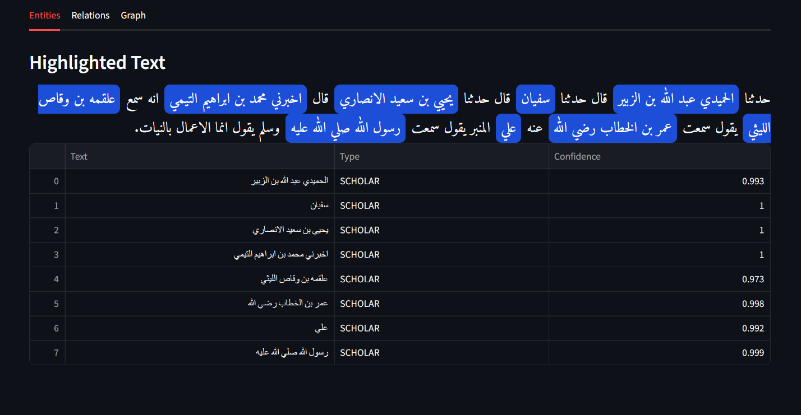
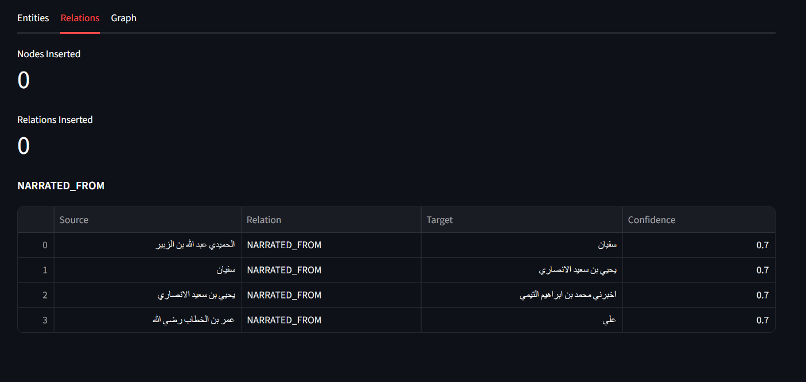

# IslamicNER - Arabic Islamic Text NER & Knowledge Graph


A domain-specific NLP pipeline that extracts scholars, books, concepts, places, and hadith references from Arabic Islamic texts and builds a navigable knowledge graph of their relationships.

## Demo


<details>
<summary>More Screenshots</summary>





</details>

## Why This Project Exists

Generic Arabic NER models underperform on hadith corpora because isnad chains, narrator name morphology, and domain vocabulary are structurally different from modern news or web text. Public benchmarks also do not cover the full entity schema needed for Islamic knowledge extraction. This project addresses that gap with a domain-specific Arabic NER model, rule-based relation extraction, and a Neo4j graph layer. This project combines NLP engineering with domain expertise in Islamic hadith sciences, enabling an entity schema and annotation strategy that generic approaches cannot replicate.

## Key Results

| Metric | Score |
|--------|-------|
| Gold F1 (overall) | 91.32% |
| SCHOLAR F1 | 91.9% |
| CONCEPT F1 | 96.6% |
| HADITH_REF F1 | 60.0% |
| PLACE F1 | 45.0% |
| Knowledge graph | 1,624 nodes, 2,585 relationships |

## How It Works

### 1. Preprocessing
The pipeline normalizes Arabic text to reduce orthographic variation before NER. It strips tashkeel (diacritics), normalizes Alif forms, maps taa marbuta and alif maqsura variants, removes tatweel, strips HTML, and collapses whitespace. This improves model consistency on classical and noisy text.

### 2. NER (AraBERT Fine-Tuning)
Entity extraction is built on `aubmindlab/bert-base-arabertv02` fine-tuned for token classification. Training data is weakly supervised: silver annotations are bootstrapped from Sanadset 650K plus hadith corpora using gazetteers and rule heuristics, then evaluated on a hand-corrected gold set.

### 3. Relation Extraction
Relations are extracted by deterministic patterns that exploit isnad structure (e.g., narration connectors such as `عن`). The current relation schema is `NARRATED_FROM`, `IN_BOOK`, `MENTIONS_CONCEPT`, and `AUTHORED`. This design prioritizes precision under limited relation-labeled data.

### 4. Knowledge Graph
Resolved entities are inserted into Neo4j using canonical forms to merge variants. Graph building includes entity normalization, relation insertion, and query helpers for scholar connectivity. The API and demo expose end-to-end text -> entities -> relations -> graph interactions.

## Entity Types

| Entity Type | Description | Example |
|-------------|-------------|---------|
| `SCHOLAR` | Narrators and scholars in sanad or commentary text | `مالك`, `البخاري`, `نافع` |
| `BOOK` | Hadith collection/work titles | `صحيح البخاري`, `سنن أبي داود` |
| `CONCEPT` | Islamic legal/theological concepts | `الربا`, `الصلاة`, `الزكاة` |
| `PLACE` | Geographic locations | `المدينة`, `مكة`, `الكوفة` |
| `HADITH_REF` | Hadith identifiers/references | `حديث رقم 1` |

## Ablation Results

| Model | Precision | Recall | F1 | Macro F1 |
|-------|-----------|--------|----|----------|
| AraBERT (standard) | 0.8964 | 0.9306 | **0.9132** | **0.7396** |
| CAMeLBERT-CA | 0.8845 | 0.9327 | 0.9080 | 0.6181 |
| AraBERT (weighted) | 0.7876 | 0.8915 | 0.8363 | 0.6062 |

Source: `models/gold_evaluation_results.json`

## Error Analysis Summary

Hallucinated entities are the dominant failure mode (47.5%). Most are false-positive `SCHOLAR` spans in matn-like contexts, suggesting isnad-heavy training bias. The largest confusion signal is `O -> SCHOLAR`.

Boundary errors account for 31.2% of errors. The model often over-extends or truncates scholar names in multi-token nasab sequences, especially around honorific context.

Missed entities represent 20.6% of errors and are concentrated in long-tail scholar mentions. This indicates recall weakness for sparse names and limited rare-name exposure.

Type confusion is low (0.7%), showing the schema is largely separable in practice. Only isolated confusion (e.g., `SCHOLAR` vs `PLACE`) appears in the gold sample.

Morphological errors were negligible in this gold set (0.0%), indicating that the normalization pipeline is handling common orthographic variation effectively.

## Limitations

- BOOK entities are nearly absent in hadith corpora and underrepresented in gold evaluation.
- Hallucinated `SCHOLAR` entities in matn sections are a major error mode (47.5% of errors).
- Entity resolution currently leaves 244 isolated scholar nodes, requiring stronger linking.
- Coverage is focused on Sunni hadith collections (Kutub as-Sitta).
- Silver training labels are weakly supervised and estimated around 70-80% quality.

## Future Work

- Train a classifier-based relation extraction model on annotated relation data.
- Expand coverage to fiqh and tafsir corpora.
- Improve entity resolution with embedding-based candidate linking.
- Add hadith grade classification as a separate downstream task.
- Build a cross-collection graph spanning multiple hadith sources.

## How To Run

```bash
pip install -r requirements.txt
uvicorn api.main:app --port 8000
streamlit run demo/app.py
```

## Repository Structure

```text
islamic-ner/
|- api/                     # FastAPI app, routes, schemas
|- demo/                    # Streamlit demo UI
|- src/
|  |- preprocessing/        # Arabic normalization + gazetteers
|  |- ner/                  # NER utilities/annotation helpers
|  |- relations/            # Rule-based relation extraction
|  |- graph/                # Entity resolver + Neo4j builder/query
|  |- evaluation/           # Metrics and analysis helpers
|- scripts/                 # Data prep, training, graph build scripts
|- tests/                   # Unit and integration tests
|- docs/                    # Gold annotation docs + technical report + screenshots
|- data/                    # Data placeholders + readme
|- models/                  # Model artifacts (gitignored in typical usage)
```

## Citation

If you use this project, cite it as:

```bibtex
@software{islamicner2026,
  title = {IslamicNER: Arabic Islamic Text NER and Knowledge Graph},
  author = {Ablaye Dia},
  year = {2026},
  url = {https://github.com/ablayed/islamic-ner}
}
```

## License

MIT License. See `LICENSE`.
